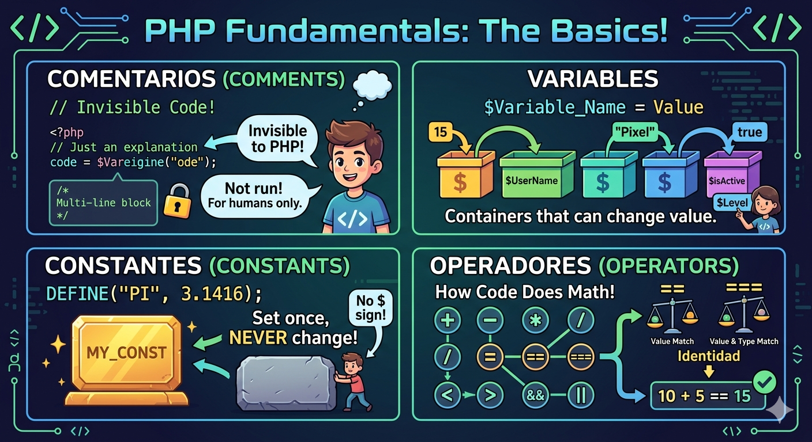

# FUNDAMENTOS DE PHP
## Comentarios
Son notas dentro del código que el servidor ignora por completo; sirven para explicar, documentar o aclarar qué hace el programa.

Una sola línea: Se usan dos barras // o una almohadilla #.

Varias líneas: Se encierran entre /* y */.

## Variables
Ambas sirven para guardar información, pero funcionan de forma distinta:

Variables: Son "contenedores" para datos que pueden cambiar durante la ejecución.

Siempre empiezan con el signo de peso ($)seguidodelnombre(ejemplo:‘edad = 25;`).

##  Constantes
Son valores fijos que NO pueden modificarse ni eliminarse una vez definidos. 
Se crean usando la función define() o la palabra clave const, y a diferencia de las variables, no llevan el signo $ antes de su nombre.

## Arrays y Arrays Asociativos
Un array permite almacenar múltiples valores en una sola variable, funcionando como una lista potente.

Arrays (Indexados): Los datos se organizan por posiciones numéricas (índices), que automáticamente empiezan desde el 0.
Por ejemplo, en una lista de frutas, la primera sería la posición 0, la segunda la 1, y así sucesivamente.

Arrays Asociativos: En lugar de usar números, utilizas nombres o "claves" personalizadas para guardar y encontrar los datos.

Se escriben en formato clave → valor (ejemplo: "nombre" => "Ana"). 

Son ideales cuando quieres asociar etiquetas con significado a los valores, como los detalles de un usuario.

#  Operadores:

### Operadores de Comparacion:
Comparan dos valores y devuelven un booleano (true o false). Importante:

== compara solo el valor
=== compara valor y tipo

### Operadores Logicos:
Se usan para evaluar varias condiciones al mismo tiempo:

&& (AND): ambas deben cumplirse
|| (OR): al menos una
! (NOT): niega la condición

### Operadores Aritméticos:
Se usan para realizar operaciones matemáticas básicas entre variables o valores. PHP soporta suma (+), resta (-), multiplicación (*), división (/) y módulo (%) que da el residuo.

### Operadores de Asignación:
Sirven para guardar valores en variables. También existen combinados que hacen operación + asignación en un solo paso.

### Operadores de Incremento/Decremento:
Se usan para evaluar varias condiciones al mismo tiempo:

&& (AND): ambas deben cumplirse
|| (OR): al menos una
! (NOT): niega la condición

